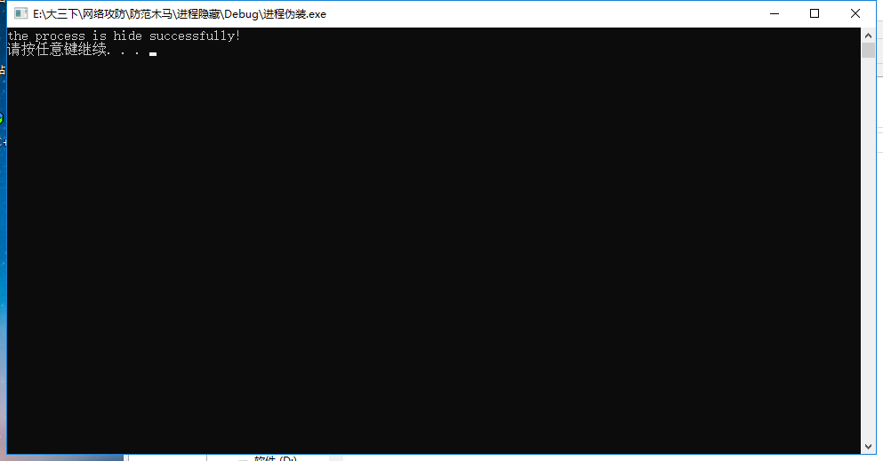

实现进程隐藏的方法有多种。利用伪装进程名从而达到进程隐藏。

函数：FxReplaceProcessPath

    功能：伪装进程
    参数：1-目标进程句柄
          2-假路径的字符串（UNICODE）
	返回值：TRUE-成功
			FALSE-失败*/

	// 获取NTDLL.DLL的基址
	HMODULE hModule = GetModuleHandle(TEXT("NTDLL.DLL"));

    // 获取ZwQueryInformationProcess函数的指针
	PZWQUERYINFORMATIONPROCESS pZwQueryInformationProcess = (PZWQUERYINFORMATIONPROCESS)GetProcAddress(hModule, "ZwQueryInformationProcess");
	
	

